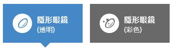
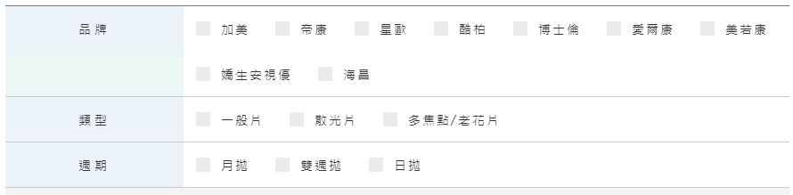
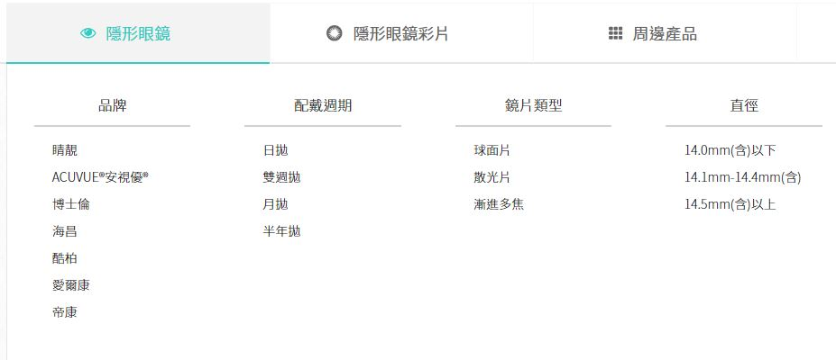
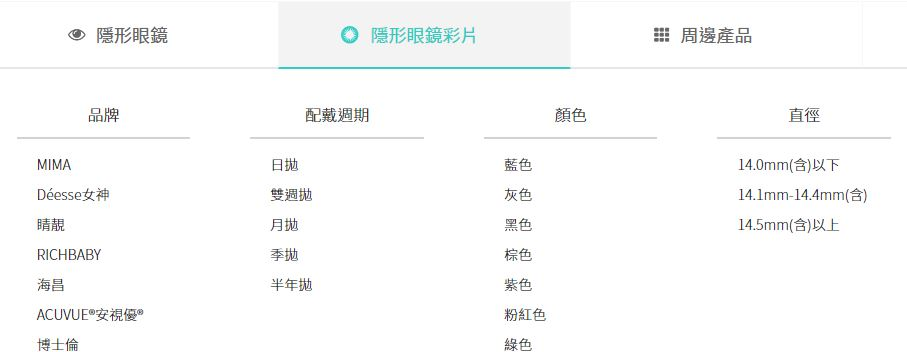
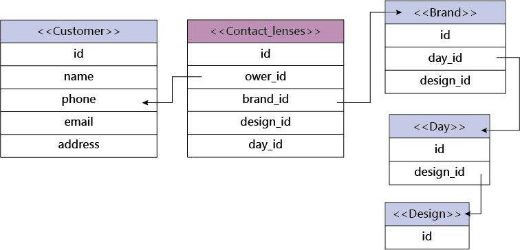
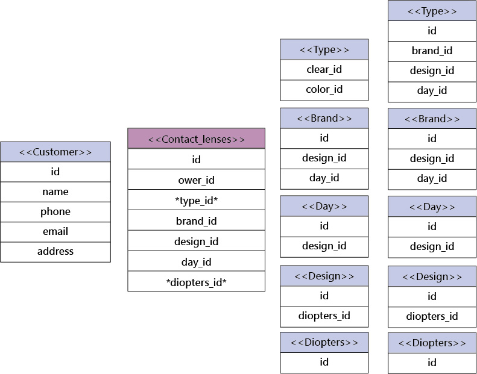
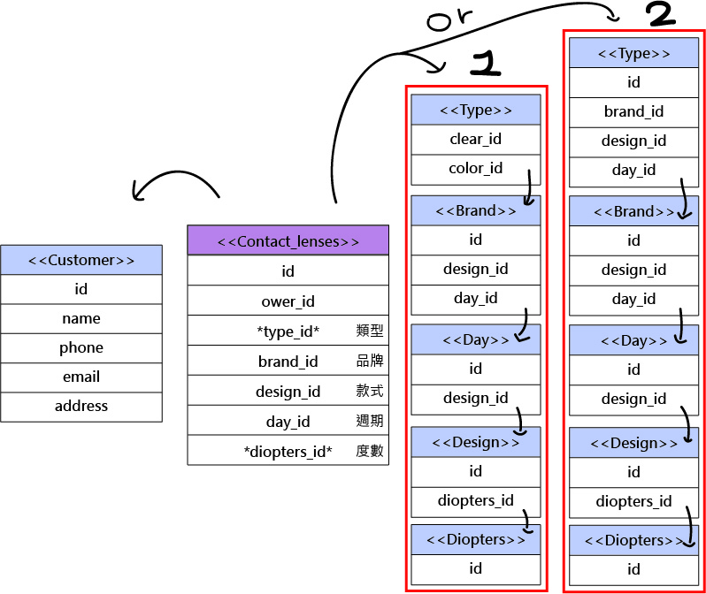

#### 1.專案說明
+   隱形眼鏡的資料庫，像小林眼鏡、文雄眼鏡的官網，單純隱形眼鏡的網站製作，不包含眼鏡鏡框。 
  + 小林眼鏡 

  + 文雄眼鏡 

#### 2.資料內容
+   相關欄位 
      + 會員資料 
        (Customer) 

        隱形眼鏡品牌 
        (Brand) 
           市面上常見品牌，以連鎖眼鏡行為基準 

        週期 
        (Day) 
          日拋、月拋、季拋、月拋 

        款式 
        (Design) 

+ 附圖1 -> 為大致上的雛形  
    <pre><code>想加入:透明/彩色、度數、價格、含水率、鏡片類型(一般球面、散光、多焦/老花) </code></pre>

+ 附圖2 -> 將上面列出想加入的挑出兩個嘗試加入 
    <pre><code>度數 
    (Diopters) 
      常見度數 : 0 , -1.00 ~ -10.00 
   類型 
    (Type) 
     透明片(clear_id) / 彩色片(color_id) </code></pre>

###### 新增的度數及類型用**標註 
 
<pre><code>下圖中標示1為type多分成了透明片clear_id跟彩色片color_id 
標示2為比照圖1的想法下去給分支 
(定義的英文和該詞實際英文不盡相同，因此標示中文，這部分有點混亂不太會排，還請老師笑納) </code></pre>

 
